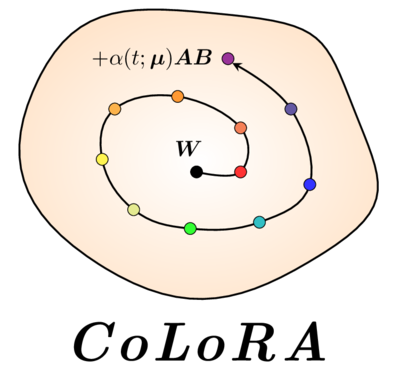
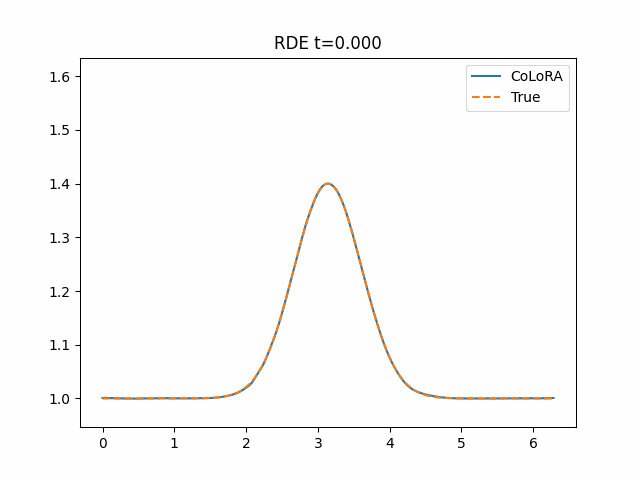
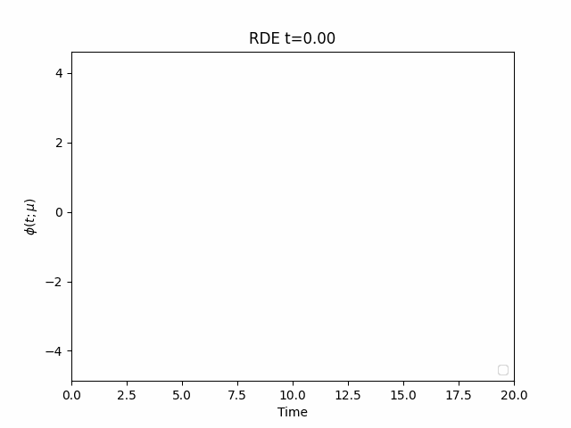

<div align="center">

</div>


# CoLoRA: Continuous low-rank adaptation

[**Setup**](#setup)
| [**Results**](#results)
| [**Cite**](#cite)
| [**Additional References**](#additional-references)

This work introduces reduced models based on Continuous Low Rank Adaptation (CoLoRA) that pre-train neural networks for a given partial differential equation and then continuously adapt low-rank weights in time to rapidly predict the evolution of solution fields at new physics parameters and new ini- tial conditions. The adaptation can be either purely data-driven or via an equation-driven variational approach that provides Galerkin-optimal approximations. Because CoLoRA approximates solution fields locally in time, the rank of the weights can be kept small, which means that only few training trajectories are required offline so that CoLoRA is well suited for data-scarce regimes. Predictions with CoLoRA are orders of magnitude faster than with classical methods and their accuracy and parameter efficiency is higher compared to other neural network approaches.

## Setup
This code was all developed with:
`
python3.11
`


First locally install the colora package with

```bash
pip install --editable .
```

Install all additional required packages run:

```bash
 pip install -r requirements.txt
```

Lastly ensure that jax is installed with the appropriate CPU or GPU support depending on where you plan to run this code. Info on installing with GPU suport can be found: [here](https://github.com/google/jax#installation)

NOTE make sure that if you install jax with GPU and cuda support that you still fix the versions of jax and jaxlib at the following:
```
jax==0.4.19
jaxlib==0.4.19
```

Then you should be able to run the included notebooks:

- vlasov.ipynb
- burgers.ipynb
- rde.ipynb

The data for each of these examples is contained in this github repository. This is not the full dataset used in the paper, but a subset which allows for easy reproduction of the main results.

Each of these notebooks should be easily runnable from top to bottom in order to produce the results show below

## Results

### Collisionless charged particles in electric field (Vlasov's Equation)
The Vlasov equation describes the motion of collision- less charged particles under the influence of an electric
field:

<span>


</span>

<br>

### Burgers’ equation in 2D
Burgers’ equations give a simplified model of fuild mechanics and can form sharp advecting fronts which are difficult for traditional methods:

<span>


</span>


### Rotating denotation waves 
We consider a model of rotating detonation waves, which is motivated by space propulsion with rotating detonation engines (RDE)

<span>


</span>

### Results Compared to other methods

| **PDE**  | **Method** | **Relative Error** | **Number Paramters** | **Reduced Dimension** |
|----------|------------|--------------------|----------------------|-----------------------|
| 2D Wave  | DINo       | 6.89e-3            | 208936               | 50                    |
| 2D Wave  | CoLoRA     | 9.22e-4            | 7505                 | 49                    |
| 1D Burg. | CROM       | 1.93e-3            | 19470                | 2                     |
| 1D Burg. | CoLoRA     | 2.74e-04           | 4521                 | 2                     |
| Vlasov   | F-FNO      | 8.57e-3            | $>10^6$              | -                     |
| Vlasov   | CoLoRA     | 9.87e-04           | 5451                 |  7                    |
| 2D Burg. | F-FNO      | 5.11e-3            | $>10^6$              | -                     |
| 2D Burg. | CoLoRA     | 4.96e-04           | 5451                 | 7                     |


## Cite

## Additional References

For details about the JAX, [reference documentation](https://jax.readthedocs.io/).

For details on other Neural Galerkin type methods see: [High Dimensions](https://arxiv.org/abs/2203.01360), [Fast Random Sparse NG](https://arxiv.org/pdf/2310.04867.pdf), [Conserving Hamiltonians](https://arxiv.org/abs/2310.07485), 

