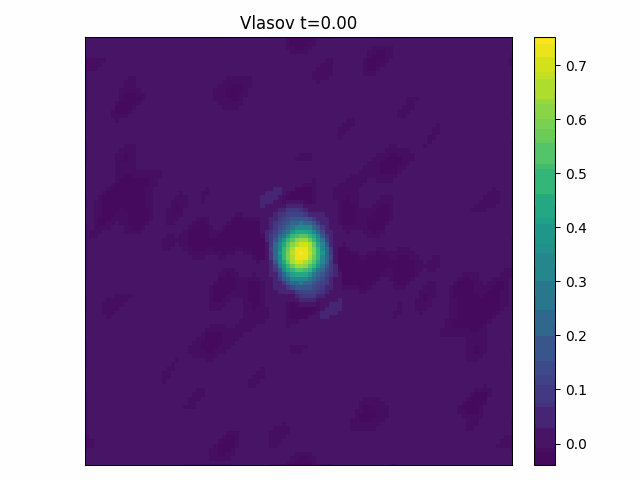

# CoLoRA: Continuous low-rank adaptation
CoLoRA: Continuous low-rank adaptation for reduced implicit neural modeling of parameterized partial differential equations

## Setup

First locally install the colora package with

```bash
pip install --editable .
```

Then install jax with the appropriate CPU or GPU support: [here](https://github.com/google/jax#installation)

Install all additional required packages run:

```bash
 pip install -r requirements.txt
```

Then you should be able to run the included notebooks:

- vlasov.ipynb
- burgers.ipynb


## Reduced models discovered via CoLoRA
<span>


</span>

<span>


</span>

## CoLoRA vs LoRA


## CoLoRA architecture
